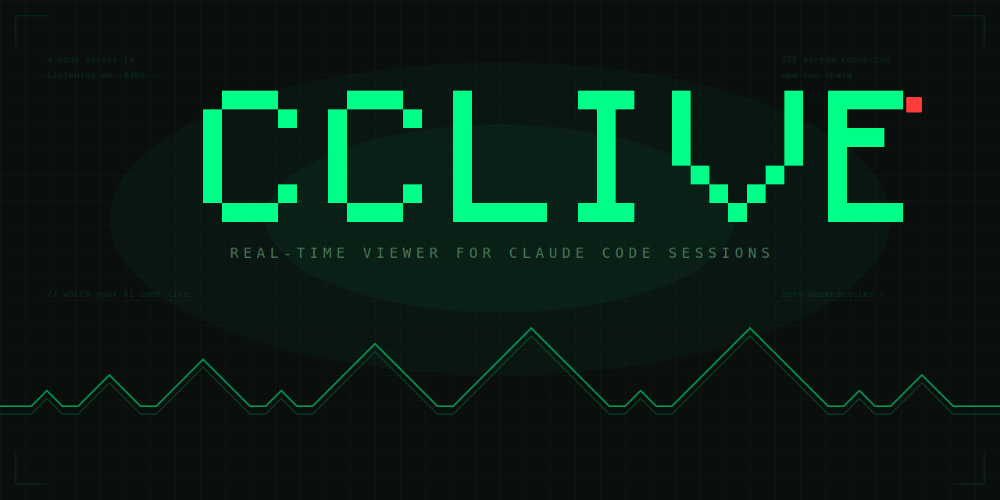

<div align="center">

# CC Live

</div>



<div>

[](https://nodejs.org/)
[](https://github.com/terryso/cc-live)
[](https://github.com/terryso/cc-live/issues)
[](https://github.com/bmad-code-org/BMAD-METHOD)
[](https://github.com/terryso/cc-live/blob/main/LICENSE)

</div>

[English](README.md)

Claude Code 会话的实时查看器。实时观看 AI 编码过程，通过 URL 分享给任何人。

**零依赖** — 单文件 Node.js 服务器，无需安装。


**实时围观：** [观看本项目的实时开发过程](https://magali-flockless-rufina.ngrok-free.dev/?t=263643f46e602c190349472b)

> **内置敏感信息过滤** — API 密钥、Token、密码等敏感信息会自动被遮蔽。但自动化过滤可能无法覆盖所有场景，**分享前仍请检查会话内容**。

## 功能

- 自动发现 `~/.claude/projects/` 下的所有 Claude Code 项目
- 通过 SSE 实时推送 — 消息即时呈现
- 按项目分组查看，支持分页和滚动导航
- 通过 Token 保护的 URL 分享单个项目
- 展示用户消息、助手回复、思考过程、工具调用及结果
- 智能工具渲染：Bash、Read、Write、Edit、Grep/Glob、Agent、TodoWrite、WebSearch 等专用格式化器
- 工具结果智能检测：语法高亮代码、格式化 JSON、彩色 Diff、渲染 Markdown
- 思考块以 Markdown 渲染，长内容支持展开/收起
- 斜杠命令以终端风格气泡展示，而非原始 XML
- 暗色主题，等宽字体，移动端适配
- 自动过滤敏感信息（API 密钥、Token、密码、私钥等）

### 弹幕互动

分享页支持**弹幕**功能——实时飘过屏幕的弹幕评论，为观众营造直播氛围。

- **发送弹幕**：在分享页底部的输入栏输入文字或选择 emoji 即可发送
- **随机昵称**：首次访问自动生成"形容词+名词"的随机昵称，可随时修改（保存到 localStorage）
- **实时广播**：新弹幕通过 SSE 实时推送给所有观众
- **历史回放**：打开页面时自动回放历史弹幕
- **开关控制**：弹幕开关可关闭，状态跨会话保存
- **性能优化**：纯 CSS 动画驱动，同屏最多 15 条弹幕
- **内容限制**：弹幕 200 字、昵称 20 字，内容经 HTML 转义防注入

## 快速开始

```bash
# 启动服务
node server.js

# 浏览器打开
open http://localhost:3456
```

无需其他操作 — 所有 Claude Code 会话自动出现在侧边栏，按项目分组。

## 外网分享

### 方式一：ngrok

```bash
# 安装 ngrok（如未安装）
# brew install ngrok

# 创建公网地址
ngrok http 3456
```

在 `.env` 中设置公网地址，使分享链接使用正确的域名：

```
CC_LIVE_PUBLIC_URL=https://your-subdomain.ngrok-free.dev
```

### 方式二：Cloudflare Tunnel

```bash
# 安装 cloudflared（如未安装）
# brew install cloudflared

# 创建公网地址
cloudflared tunnel --url http://localhost:3456
```

在 `.env` 中设置公网地址：

```
CC_LIVE_PUBLIC_URL=https://your-subdomain.trycloudflare.com
```

### 创建分享链接

1. 点击侧边栏中任意项目旁的 **Share** 按钮
2. 复制生成的 URL — 包含随机 Token，不暴露项目名
3. 随时可在侧边栏底部的 **Active Shares** 面板中撤销

Share Token 跨重启持久保存，只有主动撤销才会失效。

## 配置

环境变量（可在 `.env` 文件或命令行中设置）：

| 变量 | 默认值 | 说明 |
|------|--------|------|
| `CC_LIVE_PORT` | `3456` | 服务端口 |
| `CLAUDE_DIR` | `~/.claude` | Claude 配置目录 |
| `CC_LIVE_PUBLIC_URL` | — | 公网隧道地址，用于生成分享链接 |
| `CC_LIVE_REDACT_<N>` | — | 自定义过滤规则（见下方说明） |

### 自定义过滤规则

通过 `CC_LIVE_REDACT_1`、`CC_LIVE_REDACT_2` 等环境变量添加内置规则之外的自定义匹配：

```bash
# 纯字符串 — 精确匹配，替换为 ***REDACTED***
CC_LIVE_REDACT_1="my-company-internal-domain.com"

# 正则表达式 — /pattern/→replacement
CC_LIVE_REDACT_2="/\bmy-app-[a-z0-9]{12}\b/→***APP-ID***"
```

## 工作原理

1. 扫描 `~/.claude/projects/` 下的 JSONL 会话文件（最多 50 个项目，7 天内）
2. 加载每个会话最近 200 条消息作为历史记录，然后持续追踪新内容
3. 解析消息并通过 SSE 实时推送到浏览器
4. 每 10 秒重新扫描新会话

## 限制

- 只读 — 观看者无法与正在进行的会话交互
- 会话数据仅存于内存（每个会话最多 500 条，超出后裁剪至 300 条）
- Share Token 跨重启持久保存（存储在 `data/share-tokens.json`）

## 许可证

MIT
